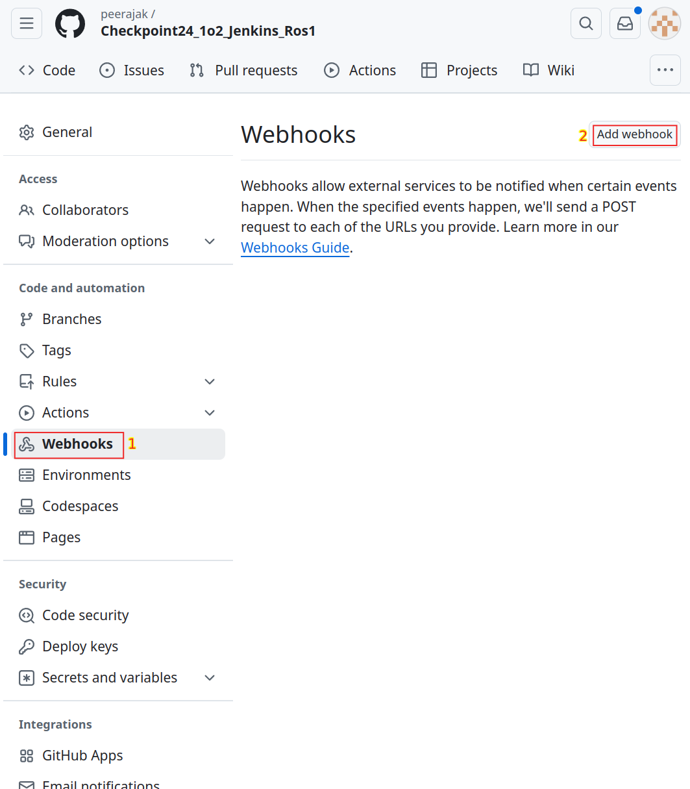
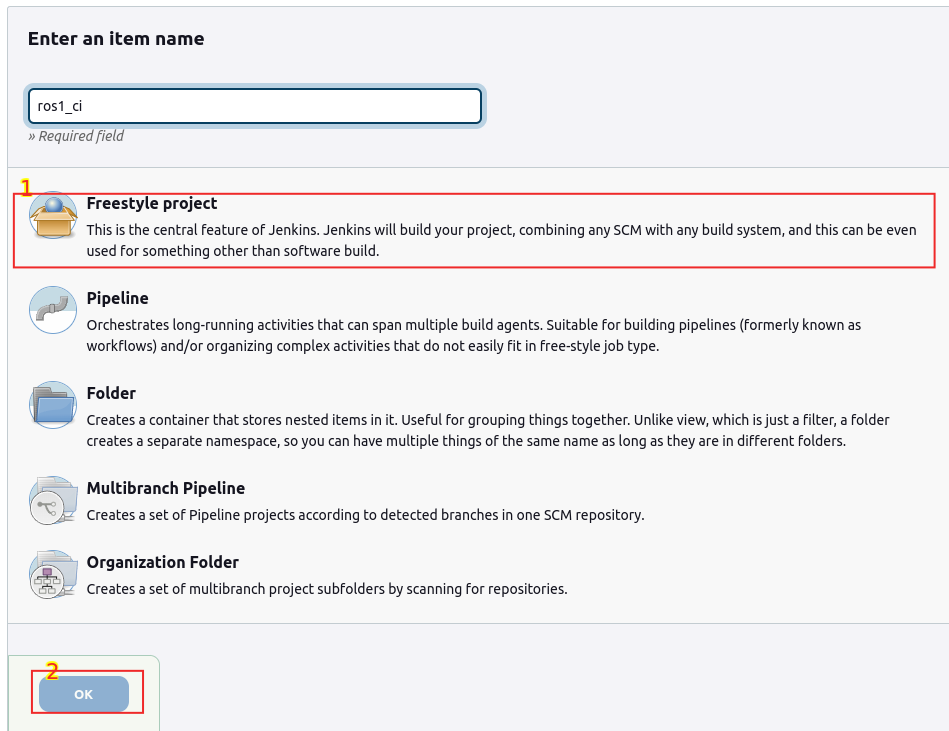
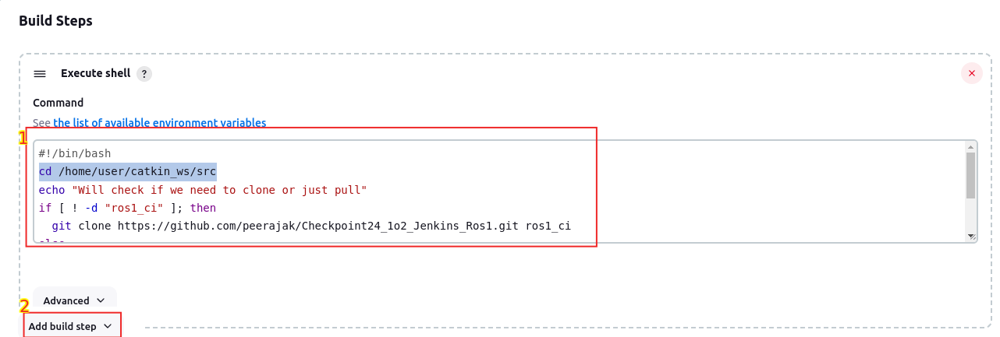

# Checkpoint24_2o2_Jenkins_Ros2

## Quick guide

1. install docker

```
cd 
./course_install.sh
```
To make docker run on user without sudo

```
sudo groupadd docker
sudo usermod -aG docker $USER
sudo gpasswd -a $USER docker
newgrp docker
```

2. start jenkins

```
cd ~/webpage_ws
./start_jenkins.sh
```

The 3 latest output of start_jenkins.sh should show the following data
- jenkins website
- password
- webhook

3. Copy webhook address to clipboard, and paste it at your github repository




4. sign in jenkins

5. copy ssh_config to ~/.ssh/config

```
cd /home/user/catkin_ws/src/ros1_ci
cp ssh_config ~/.ssh/config
```

6. Generate two ssh keys

```
cd ~/webpage_ws
bash setup_ssh_git.sh
bash setup_2nd_ssh_git.sh
rm ~/.ssh/known_hosts
```

7. create jenkins user credential for both project
8. change deploy key on Github for both projects
9. config git source for both projects.


## Jenkins
- Create a Jenkins pipeline for automating the test process
- Automate the test process on each Git push, pull request

install docker

```
cd 
./course_install.sh
```
To make docker run on user without sudo

```
sudo groupadd docker
sudo usermod -aG docker $USER
sudo gpasswd -a $USER docker
newgrp docker
```

start jenkins

```
cd ~/webpage_ws
./start_jenkins.sh
```

To find the address of jenkins website

```
echo "$(jenkins_address)"
```

Keep pressing ctrl- button and click on the website url on CLI

Your broswer should show jenkin website asking user, and password.

For user, its "admin"

password is

```
299263e4d7c34fb9b85d689ae603fda5
```

Add new pipeline, name it ros2_ci as shown in the image



### Step 3. Automate the test process on each Git push, pull request

```
cd ~/webpage_ws
bash setup_2nd_ssh_git.sh
cat /home/user/.ssh/id_rsa_2nd.pub
```

The result should look like this

```
ssh-rsa AAAAverylongverylongverylongrZvdLcpOlhE0=
```

Place the following script into the box shown in image and click add build step

```
#!/bin/bash
cd /home/user/ros2_ws/src/
echo "Will check if we need to clone or just pull"
if [ ! -d "ros2_ci" ]; then
  git clone https://github.com/peerajak/Checkpoint24_2o2_Jenkins_Ros2.git ros2_ci
else
  cd ros2_ci
  git pull origin main
fi
```


Repeat the add build step with the following code

```
cd /home/user/ros2_ws/src/ros2_ci
docker pull peerajakcp22/tortoisebot-waypoints-ros2-test:v1
```

Repeat the add build step with the following code

```
docker context use default
xhost +local:root
docker run --rm -e DISPLAY=$DISPLAY -v /tmp/.X11-unix:/tmp/.X11-unix peerajakcp22/tortoisebot-waypoints-ros2-test:v1
```

Finally Click Save

Build the project


## Build and run dockers manually

In this section, more details about how to build an run docker is written.

build docker 

```
docker build -t tortoisebot-waypoints-ros2-test:v1 .
```
```
docker tag tortoisebot-waypoints-ros2-test:v1 peerajakcp22/tortoisebot-waypoints-ros2-test:v1
docker push peerajakcp22/tortoisebot-waypoints-ros2-test:v1
```

- Running on the construct's computer

```
docker context use default
xhost +local:root
docker run -it --rm -e DISPLAY=$DISPLAY -v /tmp/.X11-unix:/tmp/.X11-unix tortoisebot-waypoints-ros2-test:v1 
```
- Running on my Local computer

```
docker context use default
xhost +local:root
docker run -it --rm -e DISPLAY=$DISPLAY -v /tmp/.X11-unix:/tmp/.X11-unix --gpus all --net=host tortoisebot-waypoints-ros2-test:v1 
```

